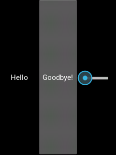
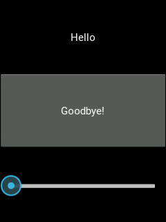
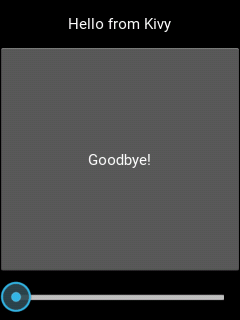
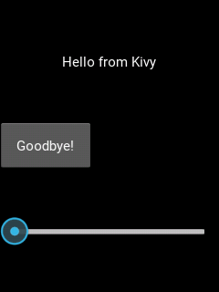

# Hello, Kivy

[Kivy](https://kivy.org/#home) is an open-source Python library for building multi-touch, cross-platform applications.  We will use Kivy to build the UI for LAMPI.

## Installing Kivy

First we need to get Kivy installed. 

### Install Kivy and examples

```bash
sudo apt-get update
source ~/lampi-venv/bin/activate
pip3 install "kivy[base]" kivy_examples
```

## Set up Kivy to use the PiTFT screen

The PiTFT touchscreen is a little quirky, so we need to change some settings to transform the input into something usable.

First, we need kivy to generate the config file for the `pi` user. Run the following commands (quitting the app after it starts with CTRL-C):

```bash
python3 -c "from kivy.app import App;App().run()"
```

This will create a config.ini file at **/home/[user]/.kivy/config.ini**.

Next, edit the file and modify these lines in the `[graphics]` section:

```
fullscreen = 0
height = 240
width = 320
rotation = 270
allow_screensaver = 0
```

Then make the `[input]` section look exactly like this (delete any other lines):

```ini
[input]
%(name)s = probesysfs,param=rotation=90,param=invert_x=1
```

Your touchscreen should now work normally in Kivy apps.

## Starting an app

To create a kivy app we need to start by subclassing `kivy.app.App`. Create a new file called **hello_app.py** and enter the following:

```python
from kivy.app import App

class HelloApp(App):
    pass
```

A couple things going on here:

```python
from kivy.app import App
```

This is an `import` statement that allows us to reference [App](http://kivy.org/docs/api-kivy.app.html). This allows us to subclass App here:

```python
class HelloApp(App):
```

`class` is a keyword in Python used to declare a class. `HelloApp` is the name of our new class. `App` is the subclass.

Finally, there's this:

```python
    pass
```

Classes in Python cannot be empty, so we use `pass` to indicate "there's nothing else in here". Once the class has content (methods, properties, anything) we can remove the pass statement.

### Running the app, part 1

We are going to set up script we can run to launch the app easily. Create a file called **main.py** and enter the following:

```python
from hello_app import HelloApp

if __name__ == "__main__":
    HelloApp().run()
```

This is the same code you ran in REPL, with one difference:

```python
if __name__ == "__main__":
```

`__name__` is a special property on Python modules that is set to `'__main__'` if the Python file was run directly as a script. This makes sure the app doesn't run if main.py should get imported as a module instead of run directly.

Save the file and exit. From the terminal, run

```bash
python3 main.py
```

You should see your app run with no errors.

If you saw this error...

```
Traceback (most recent call last):
  File "/home/pi/hello_app.py", line 1, in <module>
    from kivy.app import App
ModuleNotFoundError: No module named 'kivy'
```

...remember to activate your environment:

```bash
. lampi-venv/bin/activate
```

### Running the app, part 2
One more change! Let's make `main.py` executable directly, so that we don't need to pass it into `python3`. Edit `main.py` so it reads like so:

```python
#!/usr/bin/env python3

from hello_app import HelloApp

if __name__ == "__main__":
    HelloApp().run()
```

That first line starts with a "shebang" `#!` which causes the trailing text to be used as a script interpreter. In this case, we're saying "use whatever version of Python3 is found on the system path":

```python
#!/usr/bin/env python3
```

Next, we need to mark the file as executable. Save and exit the file and run the following command:

```bash
sudo chmod a+x main.py
```

We're using chmod to set the executable bit on `main.py` so that it can be executed directly.

### Adding UI

Now it's time to actually show something on the screen. Add a new file called **hello.kv**.

> NOTE: Kivy will look for a kv file named the same as your app (minus the "App" part) and automatically load it as the root UI. In this case, we have a **HelloApp** so our kv file is **hello.kv**.

For reference during this lab, here are the docs for [kv syntax](http://kivy.org/docs/guide/lang.html).

Let's start simply with a Label:

```
#:kivy 1.9

Label:
  text: 'Hello from Kivy'
```

Note the version number. This declares which version of kivy the files are syntax compatible with. This is only needed in this first app kv file (apps can contain multiple kv files).

Secondly, we are creating a [Label](http://kivy.org/docs/api-kivy.uix.label.html) as our root widget. This will be the only thing in our app. **text** is a property of Label. Note that it is lowercase and indented. Like Python, kv files are whitespace sensitive.

Go ahead and run **main.py**. You should see a black screen with "Hello from Kivy" in white.


### Layouts

The previous exercise works when there is a single control, but what about multiple controls? Kivy provides layout widgets that exist to handle the layout of their children in different ways. For reference, [here are the different layout controls available](http://kivy.org/docs/gettingstarted/layouts.html).

For now we will just demonstrate [BoxLayout](http://kivy.org/docs/api-kivy.uix.boxlayout.html), which stacks children sequentially, either left-to-right or top-to-bottom depending on orientation. Change **hello.kv** to add a BoxLayout with a few children:

```
#:kivy 1.9

BoxLayout:
  Label:
    text: 'Hello'
  Button:
    text: 'Goodbye!'
  Slider:
```

Run **main.py** to see the result. By default, BoxLayout wtill stack the controls horizontally:



To control the orientation, set the **orientation** property to 'horizontal' or 'vertical':

```
BoxLayout:
  orientation: 'vertical'
```


To control the size of the controls in the layout, you can use **size_hint_x** or **size_hint_y**. This specifies the size ratio between children.

```
#:kivy 1.9

BoxLayout:
  orientation: 'vertical'
  Label:
    size_hint_y: 0.15
    text: 'Hello'
  Button:
    size_hint_y: 0.7
    text: 'Goodbye!'
  Slider:
    size_hint_y: 0.15
```



So in this case, the button takes up 70% of the vertical space and the other controls take up 15% each.

Finally, if you want precise control over the size of your controls, you can set size_hint to `None` and set size to a specific value:

```
#:kivy 1.9

BoxLayout:
  orientation: 'vertical'
  Label:
    size_hint_y: 0.15
    text: 'Hello'
  Button:
    size_hint: None, None
    size: 100, 50
    text: 'Goodbye!'
  Slider:
    size_hint_y: 0.15

```

This creates a layout like so.



A couple interesting things here:

First, note that when a control is given a spcific **size**, it will take layout priority and take whatever space it needs (size_hint has to be set to None!). Then controls using **size\_hint** will layout in the remaining space. The other two controls have a size hint of 0.15, *but those values are relative to each other*. Because they are equal values, they both take 50% of the remaining space.

Second, Kivy widgets provide several properties that are linked together by a "reference list property" that can be set via a list of values. In this case, we are setting **size\_hint** to `None, None`. This is linked to the **size\_hint_x** and **size\_hint_y** properties, which will both be set to `None` here. There are several other properties you'll find like this. **pos** links **x** and **y**, **size** links **width** and **height**, **rgb** links **r**, **g**, and **b**, and so on.

Next up: go to [Events and Binding](../02.4_Events_and_Binding/README.md)

&copy; 2015-2025 LeanDog, Inc. and Nick Barendt
